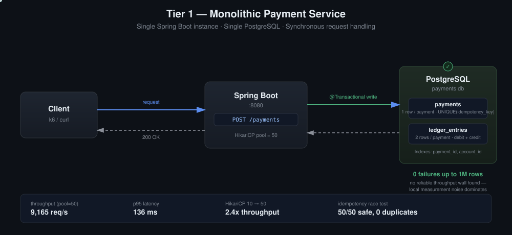

# Distributed Payment Processing — Tier 1

Single Spring Boot instance, single PostgreSQL instance, fully synchronous request handling. No queue, no cache. The goal of this tier wasn't to reach a target volume — it was to find the first wall and understand exactly why it appears.



## Stack

- Java 21 + Spring Boot (Web, Data JPA)
- PostgreSQL 16 (Docker)
- k6 for load generation

## Data model

Every payment writes to two tables, following double-entry accounting:

```
payments
  payment_id       BIGINT PK
  idempotency_key  VARCHAR UNIQUE   -- makes duplicate charges physically impossible
  status           PENDING / SUCCEEDED / FAILED / UNKNOWN
  created_at       TIMESTAMPTZ

ledger_entries
  entry_id     BIGINT PK
  payment_id   BIGINT FK -> payments
  account_id   BIGINT
  amount       BIGINT   -- cents, signed (debit/credit), never double
  created_at   TIMESTAMPTZ
```

One successful payment = 1 row in `payments` + 2 rows in `ledger_entries` (a debit and a credit that always sum to zero). Money is never lost or duplicated in transit — it's either represented by a balanced pair of ledger rows or it doesn't exist yet.

## Load test results

**Pool tuning (10K, isolating HikariCP pool size):**

| Pool size | Throughput | p50 | p95 | Failures |
|---|---|---|---|---|
| 10 | 3,607 req/s | 131ms | 198ms | 0 |
| 50 | 8,574 req/s | 49ms | 95ms | 0 |
| 100 | 8,446 req/s | 47ms | 102ms | 0 |

Default pool size (10) caps throughput regardless of client concurrency. Raising it to 50 alone produced a 2.4x throughput gain with zero code changes — the request logic was never the problem, the resource configuration was. Raising it further to 100 produced no additional gain (a slight regression from connection management overhead), marking the point where the bottleneck shifted from the connection pool to the machine itself.

**Volume scan (pool=50, 500 VUs, background IDE closed to reduce measurement noise):**

| Volume | Throughput | p50 | p95 | max | Total time | Failures |
|---|---|---|---|---|---|---|
| 10K | 2,863 req/s | 128ms | 512ms | 941ms | ~3.5s | 0 |
| 100K | 3,781 req/s | 102ms | 266ms | 883ms | ~26s | 0 |
| 500K | 3,569 req/s | 109ms | 287ms | 1.13s | ~2m 20s | 0 |
| 1M | 5,704 req/s | 88ms | 236ms | 1.37s | ~2m 55s | 0 |

**No reliable bottleneck point was found in this range.** Throughput does not decline monotonically with volume — it actually peaks at 1M rather than dropping, which is a sign the numbers are dominated by measurement noise (Docker Desktop's virtualization layer on Apple Silicon, plus the app, Postgres, and the load generator sharing one laptop's CPU) rather than by the system's own scaling characteristics. Failures stayed at 0% across every run, which is the one result trustworthy enough to state plainly: **this monolith handles up to 1M payments correctly at this volume range.** Pinpointing the true throughput ceiling would require isolating app and DB onto separate resource-limited containers or separate machines — noted as a follow-up, not treated as a finding here.

## Correctness: idempotency under concurrency

50 concurrent requests fired with the **same** idempotency key.

**Naive version (check-then-act):**
```
SELECT ... WHERE idempotency_key = ?   -- all 50 see "not found"
INSERT ...                              -- 1 succeeds, 49 hit the UNIQUE constraint
```
Result: 1× `200`, 49× `500`. Data stayed correct (exactly one `payments` row, two `ledger_entries` rows) — the UNIQUE constraint did its job — but the API itself was not idempotent: retried clients saw errors instead of the original result.

**Fix — isolate the write in its own transaction (`REQUIRES_NEW`):**
A `@Transactional` method that catches a `DataIntegrityViolationException` internally doesn't recover cleanly — Spring marks the whole transaction rollback-only the moment the exception is thrown, so anything run afterward in that same transaction fails too. Splitting the insert into its own `REQUIRES_NEW` transaction contains the failure: only that small transaction dies, and the caller can cleanly look up and return the row the winning request created.

Result after the fix: 50× `200`, still exactly 1 `payments` row / 2 `ledger_entries` rows. Retries are now silent and safe, not just non-destructive.

## Conclusion

A single Spring Boot instance backed by a single PostgreSQL instance handles up to 1M payments with correct, idempotent behavior and zero failures. Throughput at this scale is a function of local measurement conditions more than of the system's own limits — no wall was found by pushing volume alone.

The case for introducing a message queue (Tier 2) isn't throughput at this volume — it's **time**. Every request here does DB writes only, so it returns in tens of milliseconds. A real payment involves an external call (bank/card authorization) that can take seconds, not milliseconds. Held synchronously, that turns every request into a connection held open for seconds instead of milliseconds, which collapses the effective capacity of a fixed-size connection pool at a far lower request rate than anything measured above. Tier 2 exists to decouple API response time from processing time, and to improve durability by separating "accepted" from "processed."

---
