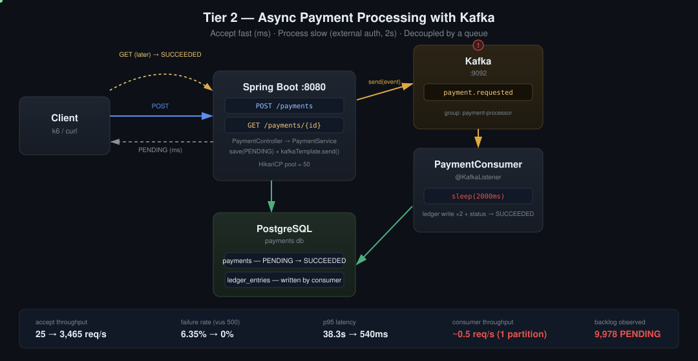

# Distributed Payment Processing — Tier 2

Tier 1 (single Spring Boot + single Postgres, fully synchronous) handles up to 1M payments correctly, but its throughput collapses the moment a request holds a connection for longer than milliseconds. This tier introduces Kafka to decouple **accepting** a payment from **processing** it, and measures exactly how much that buys — and what it doesn't.



## Why this tier exists

Every payment in Tier 1 does DB writes only, so it returns in tens of milliseconds. A real payment involves an external call (bank/card authorization) that can take seconds. To simulate this, `Thread.sleep(2000)` was added to the processing step. Held synchronously, this turns every request into a connection held open for 2 seconds instead of milliseconds.

**The math:** HikariCP pool = 50, each request holds a connection for 2s → theoretical ceiling = 50 ÷ 2 = **25 req/s**. Anything beyond that queues, and past HikariCP's 30s connection-acquisition timeout, requests start failing outright.

**Measured (vus 500, 30s sustained load):**

| | Throughput | Failure rate | vus behavior |
|---|---|---|---|
| Synchronous (Tier 1 + 2s delay) | 24.5 req/s | **3.75%** | k6 couldn't even ramp to 500 concurrent — the server was too slow to accept new virtual users, so measured concurrency climbed from 5 to 500 over the run rather than starting there |

Note the last column: this is itself a symptom, not a measurement artifact. When a server can't respond fast enough, even the load generator struggles to reach its target concurrency — a sign of just how saturated the synchronous path was. Raising the connection pool doesn't fix this — the bottleneck isn't connection count, it's connections being held for the duration of a slow external call. The fix is structural, not a bigger pool.

## What changed

`POST /payments` no longer does the slow work itself. It writes `payments` as `PENDING`, publishes a `PaymentRequestedEvent` to a Kafka topic, and returns immediately. A separate `PaymentConsumer` picks the event up off the topic and does the actual work — the 2-second delay, the ledger writes, the transition to `SUCCEEDED` — on its own time, off the request path entirely.

```
POST /payments
  → payments INSERT (PENDING)
  → kafkaTemplate.send("payment.requested", event)
  → return immediately (ms)

PaymentConsumer (@KafkaListener, separate thread)
  → receive event
  → Thread.sleep(2000)   // external auth call, simulated
  → ledger_entries INSERT ×2
  → payments UPDATE → SUCCEEDED

GET /payments/{id}   // client polls for the result later
```

## Data model changes

- `payments.updated_at` (`TIMESTAMPTZ`) added — without it, a payment stuck in `PENDING` for an unusually long time can't be distinguished from one processing normally. Set on creation and on every status transition.
- `PaymentRequestedEvent` (new) — the message shape on the wire: `paymentId`, `fromAccount`, `toAccount`, `amount`. Deliberately excludes the idempotency key, since idempotency is already resolved at the accept step; the consumer only needs enough to execute the transfer.

## Results

**Accept-path throughput (`POST /payments` only, vus 500, 30s), same session, controlled comparison:**

| | Throughput | Failure rate |
|---|---|---|
| Synchronous (Tier 1 + 2s delay) | 24.5 req/s | 3.75% |
| Async accept (Tier 2, Kafka) | **4,082 req/s** | **0%** |

**~167x throughput, failures eliminated.** The request path no longer touches the slow dependency at all — it writes one row and publishes one message, both fast, local operations. (An earlier, separate measurement session found 3,465–6,300 req/s and 134x under slightly different background load; the 167x figure above is from a controlled same-session A/B and is the one treated as authoritative here.)

**The new bottleneck this creates:**

```sql
SELECT status, COUNT(*) FROM payments GROUP BY status;
-- SUCCEEDED |    22
-- PENDING   |  9978
```

Accept-side throughput and processing-side throughput are now two different numbers. The consumer processes one event every 2 seconds (single partition, single consumer thread) — about 0.5 req/s. At that rate, the 9,978-item backlog from a few seconds of load would take roughly 5 hours to clear. This is not a failure — nothing errors, nothing times out, the queue just holds the backlog on disk — but it means "accepted" and "completed" now have a real time gap that Tier 1 never had.

**Why nothing times out waiting in the backlog:** a HikariCP timeout only fires when a *client is actively waiting on a held connection*. Once `POST /payments` returns, the connection is released immediately; nobody is waiting on the backlog inside Kafka. A message sitting unread in a topic isn't consuming a connection, a thread, or a client's patience — it's just sitting on disk until a consumer gets to it.

**The fix for the backlog is partitioning + consumer concurrency** — more partitions on `payment.requested`, `@KafkaListener(concurrency = "N")` to run N consumer threads in parallel, one per partition. This raises consumer throughput proportionally, but doesn't remove the ceiling entirely: the real constraint is the 2-second external call itself, and no number of consumers makes a bank authorize faster.

**Measured after applying this fix (3 partitions, `concurrency = "3"`):**

| | Consumer throughput | Backlog clear time (≈10K items) |
|---|---|---|
| Before (1 partition, 1 consumer thread) | ~0.5 req/s | ~5.5 hours |
| After (3 partitions, concurrency=3) | **~1.5–1.8 req/s** | **~1.5–2 hours** |

Roughly a 3x improvement, matching the theoretical expectation (0.5 req/s × 3 partitions). This confirms partitioning scales processing throughput linearly with partition/consumer count — but only up to a point. The 2-second delay per item is fixed regardless of concurrency; scaling consumers further (10x, 100x) would mean firing that many concurrent requests at the external authorization service, which has its own capacity limit that this system doesn't control. Past that point, the bottleneck stops being ours to solve with more Kafka consumers and becomes a question of the external dependency's own throughput — the kind of constraint no amount of horizontal scaling on our side removes.

## Debugging notes (things that broke and why)

A representative set of failures hit while wiring this up, since each one maps to a real Spring/Kafka concept:

- **`KafkaTemplate<String, PaymentRequestedEvent>` bean not found** — Spring's auto-configured `KafkaTemplate` is generically typed (`<Object, Object>`) and doesn't satisfy a constructor asking for a specific generic type. Fixed by registering `ProducerFactory` / `KafkaTemplate` explicitly in `KafkaConfig`.
- **`kafkaListenerContainerFactory` bean not found** — `@KafkaListener` needs a matching container factory to actually run; it isn't auto-created just because `@EnableKafka` is present when a custom `KafkaTemplate` bean already exists. Fixed by registering `ConsumerFactory` / `ConcurrentKafkaListenerContainerFactory` in the same config.
- **`ClassNotFoundException: com.fasterxml.jackson.databind.ObjectMapper`** — `JsonSerializer`/`JsonDeserializer` need Jackson on the classpath; it wasn't pulled in transitively. Fixed by adding `jackson-databind` explicitly.
- **Payment stuck on `PENDING` even though ledger rows were written correctly** — the consumer fetched a `Payment` in one transaction, then mutated it inside a different `REQUIRES_NEW` transaction. Once a transaction that loaded an entity ends, that entity is *detached*; mutating a detached object doesn't get picked up by dirty-checking in an unrelated transaction. Fixed by calling `paymentRepository.save(payment)` explicitly at the end of processing, rather than relying on automatic flush.

## Conclusion

Kafka doesn't make slow work fast — it makes the API stop waiting for it. Accept-side throughput went from a synchronous ~25 req/s (3.75–6.35% failures under load, depending on session) to an async 4,082 req/s with zero failures, by moving the 2-second cost off the request path entirely. But it doesn't automatically make total processing capacity keep up with acceptance capacity: a single-partition consumer created a new bottleneck (~0.5 req/s), invisible as errors but real as a multi-hour backlog. Scaling to 3 partitions with matching consumer concurrency recovered roughly 3x consumer throughput, confirming that horizontal scaling on the consumer side works — up to the point where the constraint stops being about how many consumers you run and starts being about how many concurrent requests the external dependency itself can absorb. Kafka scales the queue and the fan-out; it doesn't scale the bank.