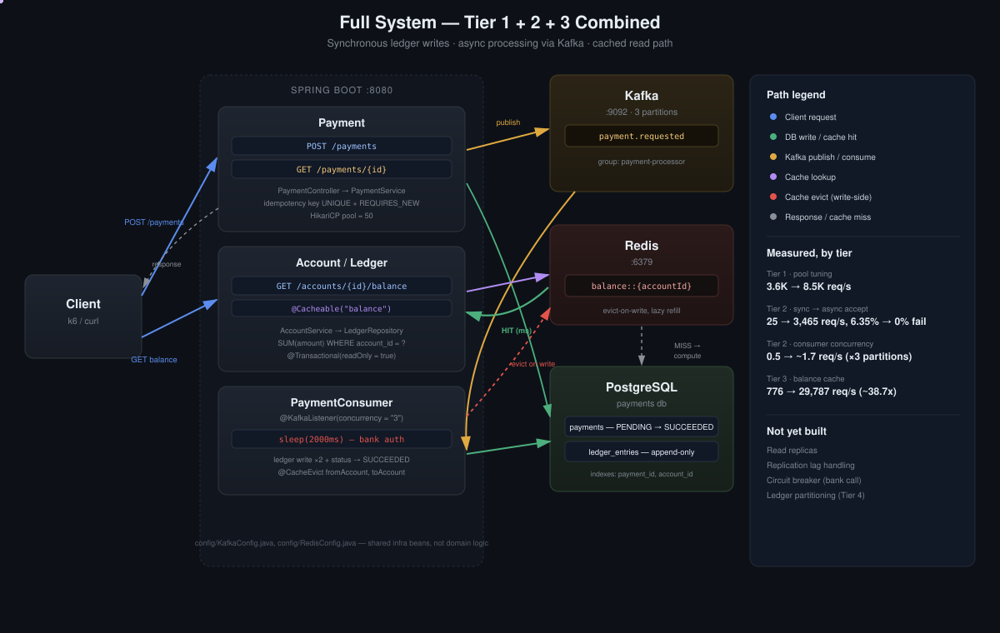

# Distributed Payment Processing — Tier 3

Tier 2 solved the write path: accepting a payment no longer waits on slow processing. This tier is about the read path — `GET /accounts/{id}/balance` — which Tier 1/2 never had to deal with, since balance was never queried under load until now.



**Status: caching for the read path is done and measured. Read replicas and replication lag were later moved to Tier 4; circuit breakers remain in Tier 4's unstarted scope.**

## Why this endpoint, and why it's a different kind of bottleneck

Every prior tier's bottleneck was about *concurrency* — how many requests can be in flight at once (connection pool size, consumer parallelism). This one is different: it's about *how much work a single query does*, and that work grows with data volume.

Balance was never stored as a column — the schema was designed from Tier 1 to derive it:

```sql
SELECT COALESCE(SUM(amount), 0) FROM ledger_entries WHERE account_id = ?
```

`COALESCE` guards the case where an account has no ledger history — `SUM` returns `NULL` on an empty set, not `0`.

An index on `account_id` makes finding the relevant rows fast, but it cannot make *summing* them free. Every row that matches has to be added, one at a time. Writes stay flat-rate regardless of table size (an `INSERT` is always an `INSERT`), but a read like this gets slower as more history accumulates for that account — the exact opposite scaling behavior from what Tier 1/2 optimized for.

## Measured: the uncached cost

100,000 payments were routed through a single account pair (`account_id=1 ↔ 2`) to build up ledger history, then `GET /accounts/1/balance` was hit with 200 concurrent VUs, 200,000 iterations, `@Cacheable` removed from the code path entirely — every single request recomputes the `SUM` from scratch (not just the first one, as would happen with a cold cache).

| | Throughput | p50 | p95 | Failures |
|---|---|---|---|---|
| No caching layer, 100K rows | 776 req/s | 256ms | 336ms | 0% |

For comparison, a simple indexed point lookup (`Payment` status by ID, Tier 1/2) runs at 8,000–9,000 req/s with p95 under 150ms. This is a ~10x throughput drop purely from replacing "find one row" with "sum many rows" on every request — no concurrency issue involved, nothing failed, it's just doing 100,000 additions every single time.

## Fix: cache the result, evict on write

```java
@Cacheable(value = "balance", key = "#accountId")
@Transactional(readOnly = true)
public Long getBalance(Long accountId) {
    return ledgerRepository.getBalance(accountId);
}
```

```java
@Transactional(propagation = Propagation.REQUIRES_NEW)
@Caching(evict = {
        @CacheEvict(value = "balance", key = "#fromAccount"),
        @CacheEvict(value = "balance", key = "#toAccount")
})
public Payment processLedgerAndFinish(Payment payment, Long fromAccount, Long toAccount, Long amount) {
    // ledger writes, status transition — unchanged from Tier 2
}
```

**The write side only ever deletes, never writes a new value into the cache.** Recomputing the sum and pushing it into the cache from the write path would mean doing that expensive `SUM` on every payment regardless of whether anyone's about to read it — wasted work — and if two payments hit the same account close together, whichever finishes last would "win" and could leave a stale value in place, a subtler version of the same check-then-act race covered in Tier 1. Deleting is idempotent: it doesn't matter how many writers evict the same key or in what order, the outcome is always "not cached." The next reader recomputes it once, lazily, and refills the cache. This is the standard cache-aside pattern, and the reason it's evict-only rather than update-in-place.

**Caveat confirmed by accident, not by design:** clearing the underlying table with `TRUNCATE` during testing left the Redis-cached balance untouched — the API kept returning a stale, very wrong number until the cache was flushed manually (`FLUSHALL`). `@CacheEvict` only fires on the code path that goes through `processLedgerAndFinish`; anything that changes the ledger outside the application (manual SQL, a migration, another service writing directly to the table) leaves the cache unaware. This is a real caching risk, not a hypothetical one — it happened in this project within the first hour of adding the cache.

## Results

**Controlled A/B — same session, same 100K-row ledger, same load profile (200 VUs, 200,000 iterations), only `@Cacheable` toggled:**

| | Throughput | p50 | p95 | Improvement |
|---|---|---|---|---|
| No cache | 776 req/s | 256ms | 336ms | — |
| Cached (`@Cacheable`) | **29,787 req/s** | **4.91ms** | **13.51ms** | **~38.4x throughput, ~52x p50** |

With 200 concurrent readers hammering the same account, only the first request pays the full `SUM` cost; the remaining 199,999 read a value already sitting in Redis. Postgres barely sees this traffic anymore — the read load that used to hit the database is now almost entirely absorbed by the cache.

*An earlier, smaller-scale measurement (100K iterations instead of 200K, and against a differently sized ledger at the time) found 347 → 15,536 req/s (~45x). The 38.4x figure above comes from a controlled same-session comparison — identical ledger, identical load, single code toggle — and is the one treated as authoritative.*

## Confirmed separately: cache throughput is independent of ledger size

The same cached endpoint was re-measured later (in Tier 4) against a 429,668-row ledger — 4.3x larger — under the same 200 VU / 30s profile, with background Kafka activity stopped to remove unrelated contention:

| | Ledger rows | Throughput | p95 |
|---|---|---|---|
| Tier 3 (this measurement) | 100,000 | 29,787 req/s | 13.51ms |
| Tier 4 re-check | 429,668 | 25,577 req/s | 14.27ms |

Throughput held in the same range despite a 4.3x larger table — consistent with the mechanism: once a value is cached, every subsequent read is a Redis key lookup, not a `SUM` over ledger rows, so the two are fully decoupled after the first cache miss regardless of table size.
