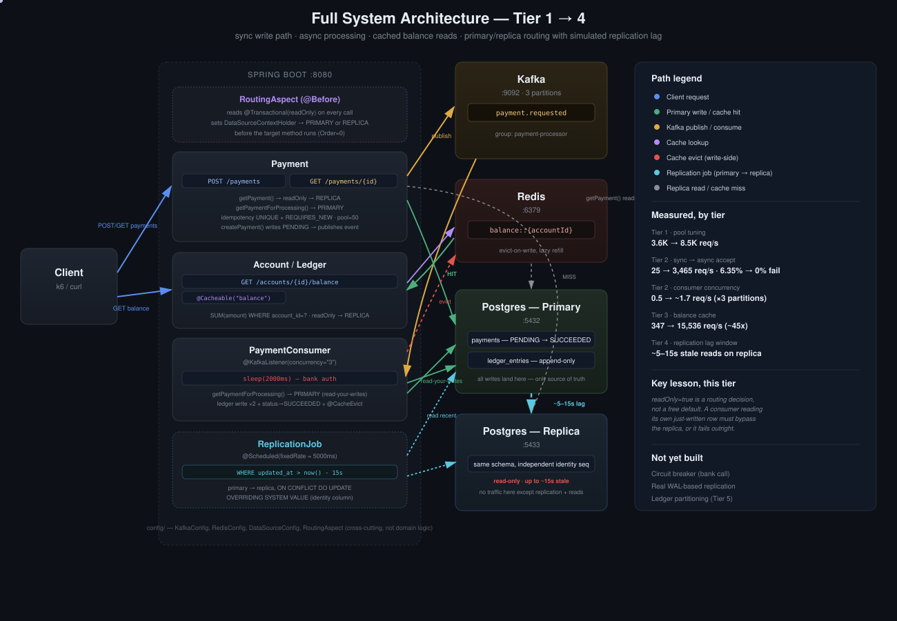

# Distributed Payment Processing — Tier 4

Tier 3 solved the read *cost* problem (an expensive `SUM` recomputed on every request). This tier splits the read *path* itself — routing reads to a separate replica instance so a single Postgres node isn't serving both the write load and the read load — and confronts what that split actually costs in correctness.



**Status: read/replica routing and simulated replication lag are done and measured. Circuit breaker / bank-call resilience (the second half of this tier's original scope) is not yet started.**

## Why this is a different kind of split than Tier 3

Tier 3 kept one database and made a specific query cheaper. This tier introduces a second database — a read replica — and makes Spring route `readOnly = true` transactions to it. The replica isn't a real Postgres streaming replica (that requires WAL-level configuration this project deliberately skipped for setup complexity); it's a second, independent Postgres instance kept in sync by an application-level job. This was chosen specifically to make the failure mode of replication — not just its benefit — directly observable rather than abstract.

## How the routing works

```
@Transactional(readOnly = true)  →  RoutingAspect (AOP, runs @Before the method)
                                  →  DataSourceContextHolder.set(REPLICA)
                                  →  RoutingDataSource.determineCurrentLookupKey()
                                  →  actual query runs against the replica connection

no readOnly, or readOnly = false →  routed to PRIMARY (the default)
```

`RoutingAspect` intercepts every `@Transactional` method *before* it runs and inspects the annotation directly — Spring doesn't expose "this transaction is read-only" as information a component can just ask for, so the interception has to happen at the point the annotation is evaluated, not by inferring it from the HTTP verb or anything else at the boundary.

## The failure this setup was built to surface

The first version routed **all** reads — including a payment consumer reading back the row it had just inserted seconds earlier — through `@Transactional(readOnly = true)`, and therefore through the replica. Since the replica has no automatic sync mechanism, this produced a real, reproducible failure:

```
Caused by: java.lang.IllegalStateException: Payment not found: 2
```

The consumer wrote to primary, then immediately tried to read the same row back through a method that routed to a database that had never received it. This is the read-your-own-writes problem in its sharpest form — not "occasionally stale," but "never present," because nothing in this setup copies primary's writes to the replica automatically.

**Fix:** split the read into two methods with different freshness guarantees.

```java
// External clients polling for status — staleness is acceptable
@Transactional(readOnly = true)
public Optional<Payment> getPayment(Long paymentId) {
    return paymentRepository.findById(paymentId);
}

// The consumer reading back what it just wrote — must never be stale
public Optional<Payment> getPaymentForProcessing(Long paymentId) {
    return paymentRepository.findById(paymentId);
}
```

The distinction that matters is not "who's calling this" — it's whether the caller can tolerate reading a value that hasn't caught up yet. `readOnly = true` is a routing decision with a correctness consequence, not a free performance default; applying it to every read indiscriminately breaks the one read that structurally requires freshness.

## Making replication lag real instead of permanent

With no sync mechanism, the replica would never catch up — that's not "lag," that's "absent." A `@Scheduled` job was added to close that gap on a real (if simulated) delay:

```java
@Scheduled(fixedRate = 5000)
public void replicatePayments() {
    List<PaymentRow> recentRows = primaryJdbc.query(
        "SELECT ... FROM payments WHERE updated_at > now() - interval '15 seconds'", ...);

    for (PaymentRow row : recentRows) {
        replicaJdbc.update(
            "INSERT INTO payments (...) OVERRIDING SYSTEM VALUE VALUES (...) " +
            "ON CONFLICT (payment_id) DO UPDATE SET status = EXCLUDED.status, updated_at = EXCLUDED.updated_at",
            ...);
    }
}
```

Runs every 5 seconds; the 15-second lookback window is intentionally wider than the run interval so a row can't fall through a gap between two runs — the cost of the overlap is a few redundant no-op updates, which is cheap and safe (an `ON CONFLICT ... DO UPDATE` on the same values is idempotent), versus the alternative of silently missing a row.

**A schema-level trap worth naming:** `payment_id` is `GENERATED ALWAYS AS IDENTITY`, which by design refuses any explicitly supplied value — necessary on the primary (nothing should be able to fake an ID), but exactly what the replication job needs to violate, since it has to write primary's actual ID, not let the replica invent its own. Postgres has an explicit escape hatch for this, `OVERRIDING SYSTEM VALUE`, precisely because "copy this exact row including its identity" is a legitimate, distinct use case from "insert a new row."

## Measured: the lag window is real and bounded

```
POST /payments               → {"paymentId":1,"status":"PENDING"}   (primary, immediate)
GET  /payments/1  (0s later) → 404                                   (replica hasn't caught up)
... wait ~8s ...
GET  /payments/1             → {"paymentId":1,"status":"SUCCEEDED"}  (replication job has run)
```

The window is bounded by two things stacked: the consumer's own processing time (currently 2s, simulating a bank call) plus up to one replication job cycle (5s). A client polling `GET /payments/{id}` immediately after a `POST` can legitimately see a 404 for a payment that exists and is actively being processed — not an error condition, but an accurate reflection of where the data currently lives.

## A prediction that turned out wrong: does splitting primary/replica raise throughput?

The natural hypothesis after building the routing layer: with writes going to primary and reads going to replica, concurrent write and read load shouldn't contend with each other the way they would on a single instance — so both should hold closer to their Tier 1 solo numbers even when run at the same time.

**Measured (200 VUs each, 30s duration, run concurrently, `Thread.sleep` disabled to isolate DB throughput):**

| | Throughput | p50 | p95 | Failures |
|---|---|---|---|---|
| Write (`POST /payments`, primary) | 2,026 req/s | 81ms | 206ms | 0% |
| Read (`GET /payments/{id}`, replica) | 2,120 req/s | 78ms | 200ms | **0.55%** |

For comparison, Tier 1 measured ~9,165 req/s for writes alone and 8,000–9,000 req/s for simple reads alone. Both numbers here dropped to roughly a fifth of their solo values — the opposite of the hypothesis, and the read path even picked up a nonzero failure rate it didn't have in isolation.

**Why:** primary and replica are two Postgres containers on the same physical machine, competing for the same CPU and disk — the same constraint that showed up repeatedly from Tier 1 onward (Docker Desktop's virtualization overhead, everything sharing one MacBook Air). Splitting the *logical* routing of reads and writes doesn't grant either path its own *physical* resources when both instances still share one host. The `ReplicationJob` polling every 5 seconds in the background adds further contention on top. This setup would very plausibly behave as hypothesized on separate machines; on one laptop, "primary vs replica" is a correctness and routing exercise, not a throughput lever. Recorded here rather than smoothed over, consistent with how Tier 1's inconsistent volume-scan numbers were handled — a wrong prediction, measured honestly, is more useful than a hypothesis nobody checked.

## A prediction that held: cache throughput is independent of ledger size

Tier 3 measured a 45x throughput gain from caching at 100K ledger rows on one account. The open question was whether that held at a meaningfully larger scale, or whether it was specific to that row count.

**Measured, cache warm, Kafka stopped to remove consumer/replication contention (200 VUs, 30s):**

| | Ledger rows (account 1) | Throughput | p50 | p95 | Failures |
|---|---|---|---|---|---|
| Tier 3 | 100,000 | 15,536 req/s | 6.93ms | 48.7ms | 0% |
| Tier 4 | 429,668 | **25,577 req/s** | 6.75ms | **14.27ms** | 0% |

A 4.3x larger ledger produced no throughput regression — if anything, both p50 and p95 improved (largely attributable to Kafka being stopped for this run, removing background contention rather than the ledger-size difference itself). This confirms the mechanism directly: once a value is cached, every subsequent read is a Redis key lookup, not a `SUM` over ledger rows — the two are fully decoupled after the first cache miss, regardless of how large the underlying table is.

**A data-integrity issue surfaced while building up to this test, worth recording separately from the result above.** Under sustained heavy load (1M payments being published while the consumer, `ReplicationJob`, and two concurrent k6 runs were all active), `ledger_entries` began accumulating duplicate rows per `payment_id` — one row observed with 8 ledger entries instead of 2 — while `payments.status` stopped advancing past a fixed count entirely. The Hibernate query log showed the same payment's `SELECT`/`UPDATE`/`INSERT` sequence repeating with no exception ever logged, which is the signature of a Kafka consumer group rebalance: if a consumer takes too long between polls (plausible here, given how many things were competing for the same machine), the broker can decide it's dead, reassign its partition, and redeliver messages the original consumer was already partway through — producing duplicate ledger writes with no error anywhere in the stack. This wasn't chased to a fix in this session; it's flagged here as a concrete, observed instance of the at-least-once delivery problem the project's guide called out from Tier 2 onward, now seen under real load rather than described in the abstract.
# tier4
